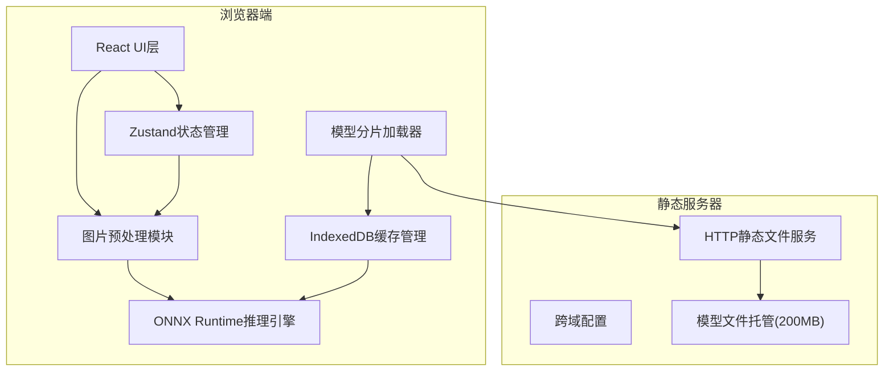

## 1. 架构设计



## 2. 技术描述

- **前端框架**：React@18 + TypeScript + Vite
- **样式方案**：TailwindCSS@3
- **状态管理**：Zustand
- **图标库**：lucide-react
- **AI推理引擎**：onnxruntime-web@1.17.x
- **数据库**：IndexedDB (idb库封装)
- **后端服务**：Express@4 (仅用于静态文件托管和CORS配置)
- **模型分片**：3个并行下载的chunk，总大小约200MB

### 核心技术点说明

1. **ONNX Runtime Web**：使用WebGL backend加速推理，支持CPU fallback
2. **图片预处理**：Canvas API实现resize到224x224，按照ImageNet标准归一化(mean=[0.485,0.456,0.406], std=[0.229,0.224,0.225])
3. **模型分片加载**：使用Promise.all并行下载3个chunk，通过ReadableStream实时更新进度
4. **IndexedDB缓存**：使用Blob存储模型文件，第二次访问直接从本地读取
5. **流式文本生成**：逐token生成，通过setTimeout让渡主线程避免UI卡顿

## 3. 项目结构

```
e:\trae3\8
├── src/
│   ├── components/
│   │   ├── ImageUploader.tsx      # 图片上传组件
│   │   ├── ModelLoader.tsx        # 模型加载进度组件
│   │   ├── InferenceProgress.tsx  # 推理进度组件
│   │   ├── ResultDisplay.tsx      # 结果展示组件
│   │   └── CacheManager.tsx       # 缓存管理组件
│   ├── hooks/
│   │   ├── useImagePreprocess.ts  # 图片预处理hook
│   │   ├── useModelLoader.ts      # 模型加载hook
│   │   └── useInference.ts        # 推理引擎hook
│   ├── utils/
│   │   ├── imageProcessor.ts      # 图片处理工具
│   │   ├── tensorUtils.ts         # Tensor操作工具
│   │   ├── indexedDB.ts           # IndexedDB封装
│   │   └── modelChunker.ts        # 模型分片管理
│   ├── store/
│   │   └── appStore.ts            # Zustand状态管理
│   ├── types/
│   │   └── index.ts               # 类型定义
│   ├── App.tsx
│   ├── main.tsx
│   └── index.css
├── api/
│   └── server.ts                  # Express静态服务器
├── public/
│   └── models/                    # 模型文件目录(模拟)
│       ├── vit_encoder_chunk1.onnx
│       ├── vit_encoder_chunk2.onnx
│       └── gpt_decoder_chunk3.onnx
├── vite.config.ts
├── tailwind.config.js
└── package.json
```

## 4. 状态管理定义

```typescript
interface AppState {
  // 模型加载状态
  modelChunks: {
    id: string;
    name: string;
    size: number;
    downloaded: number;
    status: 'pending' | 'downloading' | 'cached' | 'loaded' | 'error';
  }[];
  modelLoadingProgress: number;
  isModelReady: boolean;
  
  // 推理状态
  inferenceStep: 'idle' | 'preprocessing' | 'encoding' | 'decoding' | 'complete';
  inferenceProgress: number;
  generatedText: string;
  isInferencing: boolean;
  
  // 图片状态
  uploadedImage: File | null;
  imagePreview: string | null;
  
  // 缓存状态
  cacheSize: number;
  
  // Actions
  uploadImage: (file: File) => void;
  clearImage: () => void;
  startInference: () => Promise<void>;
  updateChunkProgress: (id: string, downloaded: number) => void;
  setChunkStatus: (id: string, status: ChunkStatus) => void;
  setInferenceStep: (step: InferenceStep) => void;
  appendGeneratedText: (text: string) => void;
  clearCache: () => Promise<void>;
}
```

## 5. 关键算法流程

### 5.1 图片预处理流程

```
输入: HTMLImageElement
1. 创建224x224 Canvas
2. 绘制图片(保持宽高比，中心裁剪)
3. 获取ImageData (RGBA, 0-255)
4. 转换为Float32Array (HWC -> CHW)
5. 归一化: (value / 255 - mean) / std
6. reshape为 [1, 3, 224, 224] tensor
输出: ort.Tensor
```

### 5.2 推理流程

```
1. 预处理图片得到视觉特征
2. ViT编码器: image_tensor -> image_embeddings [1, 512]
3. 初始化GPT-2输入: <|startoftext|> token
4. 循环(max_length=50):
   a. GPT解码器: [input_tokens, image_embeddings] -> next_token_logits
   b. 采样: argmax或top-k采样得到下一个token
   c. 追加到输出序列
   d. 转换token为文本，更新UI
   e. 如果遇到<|endoftext|>，退出循环
5. 返回完整描述文本
```

### 5.3 模型分片加载流程

```
1. 检查IndexedDB中是否有3个模型分片
2. 如果有缺失，并行发起3个fetch请求
3. 每个请求通过ReadableStream获取进度
4. 下载完成后存入IndexedDB (Blob格式)
5. 从IndexedDB读取所有分片，合并为完整模型
6. 加载到ONNX Runtime InferenceSession
```

## 6. API 定义 (后端)

### 6.1 静态文件服务

| 路径 | 方法 | 用途 |
|------|------|------|
| /models/* | GET | 提供模型文件下载，支持Range请求 |
| /* | GET | 提供前端静态资源 |

### 6.2 CORS 配置

```typescript
{
  origin: '*',
  methods: ['GET', 'HEAD'],
  allowedHeaders: ['Range', 'Content-Type'],
  exposedHeaders: ['Content-Range', 'Content-Length', 'Accept-Ranges'],
  maxAge: 86400
}
```

## 7. 性能优化策略

1. **Web Worker**：模型加载和推理在Web Worker中执行，避免阻塞主线程
2. **模型分片**：3个chunk并行下载，利用浏览器多连接特性
3. **内存管理**：推理完成后及时调用tensor.dispose()释放GPU内存
4. **懒加载**：ONNX Runtime仅在需要时初始化
5. **HTTP缓存**：模型文件设置Cache-Control: public, max-age=31536000, immutable
