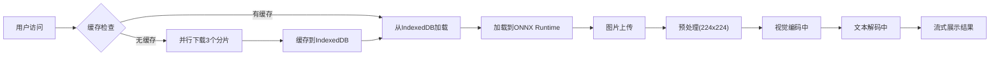

## 1. 产品概述

多模态AI图像描述生成器是一个纯前端Web应用，用户上传图片后，应用在浏览器本地使用ONNX Runtime Web运行预训练的视觉编码器（ViT-B/32）和文本解码器（GPT-2小型版本）进行联合推理，自动生成图片的文字描述。无需后端API参与推理过程，保护用户隐私，支持离线使用。

- **核心价值**：让用户无需上传图片到服务器即可获得AI生成的图像描述，保护隐私的同时提供流畅的交互体验
- **目标用户**：对AI技术感兴趣的开发者、需要图像描述功能的创作者、关注数据隐私的用户

## 2. 核心功能

### 2.1 功能模块

1. **首页**：图片上传区域、模型加载状态展示、推理进度指示器、生成结果展示区

### 2.2 页面详情

| 页面名称 | 模块名称 | 功能描述 |
|-----------|-------------|---------------------|
| 首页 | 图片上传区 | 支持拖拽上传、点击选择文件、支持JPG/PNG/WebP格式 |
| 首页 | 模型加载区 | 显示三个模型分片的并行下载进度、IndexedDB缓存状态 |
| 首页 | 推理进度区 | 实时显示当前步骤：图片预处理中 / 视觉编码中 / 文本解码中 |
| 首页 | 结果展示区 | 展示上传图片预览、流式输出的AI描述文本、复制按钮 |
| 首页 | 缓存管理 | 显示缓存占用大小、提供清除缓存功能 |

## 3. 核心流程

用户进入应用 → 检查IndexedDB缓存 → 如无缓存则并行下载3个模型分片 → 缓存到IndexedDB → 加载模型到ONNX Runtime → 用户上传图片 → 图片预处理(resize/归一化/转tensor) → 视觉编码器提取特征 → 文本解码器生成描述 → 流式展示结果

## 4. 用户界面设计

### 4.1 设计风格

**设计方向**：科技感赛博朋克风格，突出AI技术的未来感和专业性

- **主色调**：深邃太空蓝 `#0a0e27` 作为背景主色
- **强调色**：霓虹青 `#00f5ff` 用于进度条和交互元素，配合霓虹紫 `#bf00ff` 作为辅助色
- **中性色**：深灰 `#1a1f3a` 作为卡片背景，浅灰 `#e0e7ff` 作为文本色
- **字体**：显示字体使用 `Orbitron`（未来感等宽字体），正文字体使用 `JetBrains Mono`（代码风格字体）
- **按钮风格**：圆角8px，霓虹发光边框，悬停时增强发光效果
- **布局风格**：网格化卡片布局，带有扫描线和噪点纹理，营造科技感
- **图标风格**：线性图标，使用霓虹色描边

### 4.2 页面设计概述

| 页面名称 | 模块名称 | UI元素 |
|-----------|-------------|-------------|
| 首页 | 整体布局 | 深色背景带网格纹理，居中卡片式布局，顶部标题带发光效果 |
| 首页 | 上传区域 | 虚线边框卡片，拖拽时有脉冲动画，显示上传图标和提示文字 |
| 首页 | 加载进度 | 三个并行的进度条，每个显示分片名称和百分比，完成时显示绿色对勾 |
| 首页 | 推理状态 | 大型状态指示器，当前步骤高亮显示，前序步骤打勾，带有脉冲动画 |
| 首页 | 结果展示 | 左侧图片预览带边框发光，右侧文本区域支持打字机动画流式输出 |
| 首页 | 缓存信息 | 底部小型信息栏，显示缓存大小，清除按钮 |

### 4.3 响应式设计

- **桌面端（默认）**：左右布局，图片预览在左，文本结果在右，最大宽度1200px
- **平板端（768px-1024px）**：上下布局，图片预览在上，文本结果在下，宽度自适应
- **移动端（<768px）**：单列布局，适当缩小字体和间距，优化触摸区域大小

### 4.4 动画与交互

- 页面加载：元素依次淡入，标题有渐变扫光效果
- 拖拽上传：边框颜色变化，内部有轻微缩放动画
- 进度条：平滑过渡动画，完成时有庆祝动效
- 文本生成：打字机效果逐字显示，光标闪烁
- 悬停效果：按钮和卡片有发光增强和轻微上浮
